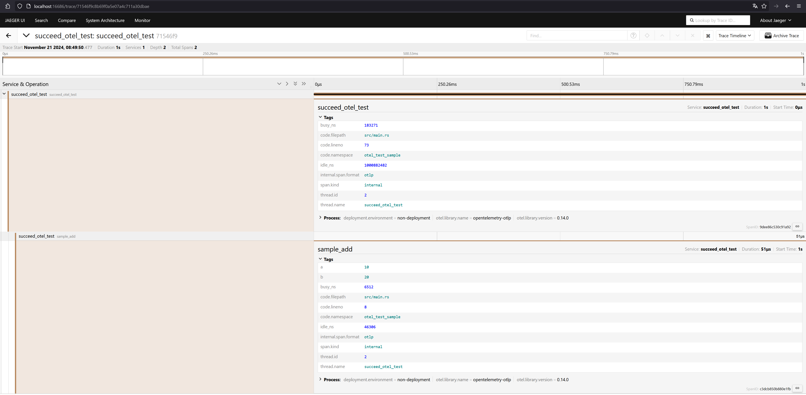

# OpenTelemetry を使ったテストコード計装のサンプル

## 仕様：できること
- #[tokio::test] マクロのみが付与されているテストコードを、マクロ一行で計装（内部的に、otel tracer を起動・終了し、指定した endpoint に送信可能）できる
- 1テスト実行時に、計装すること。
- 1テストの計装内容が、Jaeger (localhost:16686) で見れる

## 仕様：できないこと
- #[tokio::test(X=...)] として入っている、オプションの展開は現状非対応
- 複数テストの同時実行時に、テストの計装すること。(テスト間で、global::tracer を共有してしまうのを原因と想定しており、同時計装は非対応の予定です。)

## 実行例/コード例
#### 1: コードの配置
リポジトリと同様のフォルダ構成にしてください。
```
project-root/
├── src/
│   ├── XXX.rs   # テストコードの入ったRustコード
├── otel-util/   # リポジトリからとってください
├── Cargo.toml   # ご自身のCargo.toml
├── compose.yaml # リポジトリからとってください
├── telemetries  # リポジトリからとってください
└── README.md
```
#### 2: Cargo.toml に以下を追加してください。

```toml
[dependencies]
otel-util = { path = "./otel-util", version = "*" }

[workspace]
members = ["otel-util"]
```

#### 3: ローカルのJaeger/otel-collector の起動
```sh
# プロジェクトへcd後
docker compose up -d
```

#### 4: 計装対象のテストへのコード付与

以下のように、tokio::testの代わりに、#[use_otel_at_test]で計装実施可能。endpoint なしだと、デフォルト：endpoint="http://localhost:4317"が設定されている。

注意）テストコードから呼び出されるコードに対して、tracing::instrument(err)を付与しないと、計装対象にならないため、必要に応じて、マクロを付与。

```rust
use anyhow::{anyhow, Result};
use otel_util::{tracing, use_otel_at_test};

#[tracing::instrument(err)]
fn sample_add(a: u64, b: u64) -> Result<u64> {
    Ok(a + b)
}

#[use_otel_at_test(endpoint="http://localhost:4317")]
async fn succeed_otel_test() {
    // given
    let a = 10;
    let b = 20;
    tokio::time::sleep(tokio::time::Duration::from_secs(1)).await;
    let c = sample_add(a, b).unwrap_or(0);

    // then
    assert_eq!(a + b, c);
}

```

#### 5: 計装対象のテスト実施
本サンプルコードのテスト例。（自身のテストの場合は、そのテスト名に置き換えてください）
```sh
cargo test failed_otel_test
cargo test succeed_otel_test
cargo test panic_otel_test
```

注意）複数テストの同時実行時には、現状テストの計装は不可能です。(テスト間で、global::tracer を共有してしまうのを原因と想定しており、同時計装は非対応の予定です。)

#### 6: 計装結果の確認
Serviceにテスト名が表示される。


succeed_otel_test の結果：呼出し先関数のspan は、#[tracing::instrument()]　を付与している場合は記録される。


failed_otel_test の結果：呼出し先関数で起きた error は、#[tracing::instrument(err)]　を付与している場合は記録される。


panic_otel_test の結果：panic も表示される。
